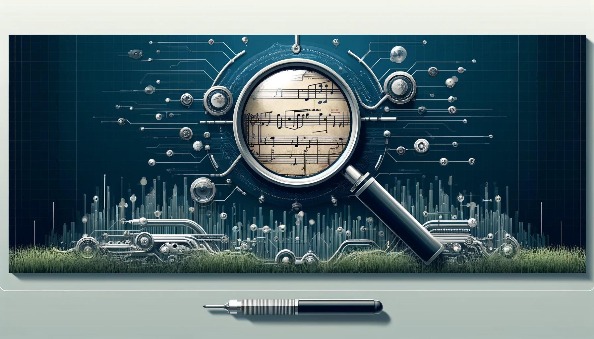
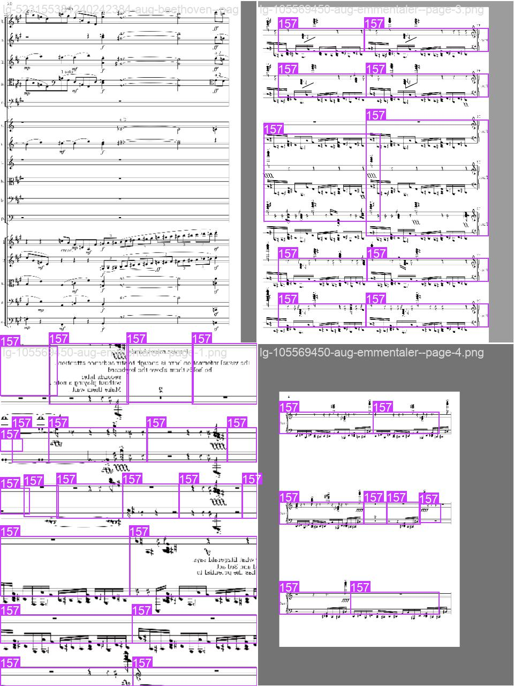

  <strong>Optical Music Recognition</strong>

## Table of Contents
- [Overview](#overview)
- [Dataset](#dataset)
- [Models and Techniques](#models-and-techniques)
  - [Model Training](#model-training)
  - [Faster R-CNN Training](#faster-r-cnn-training)
- [Image Processing](#image-processing)
  - [Image Scaling and Bounding Boxes](#image-scaling-and-bounding-boxes)
  - [Advanced Image Manipulations](#advanced-image-manipulations)
  - [Annotation Adjustment](#annotation-adjustment)
- [Barline Extraction and Measure Detection](#barline-extraction-and-measure-detection)
- [Results](#results)
- [Future Work](#future-work)
- [Contributors](#contributors)
- [Acknowledgements](#acknowledgements)

## Overview
This project focuses on training models to detect and classify musical symbols using the <a href="https://zenodo.org/records/4012193">The DeepScoresV2</a> dataset.

## Dataset
<a href="https://zenodo.org/records/4012193">The DeepScoresV2</a>  dataset, comprising high-resolution images of musical scores annotated with precise symbol locations and types, serves as the training and validation ground for our models. This dataset is pivotal for training due to its diversity in musical notation and complexity.

## Models and Techniques

### Model Training
We have employed three You Only Look Once (YOLO) models, each tailored for detecting different types of musical symbols within the scores:
- **YOLO for All Symbols**
- **YOLO for Barlines**
- **YOLO for Measures**

#### YOLO Training Details
We trained our models using the following configurations:
- **Model**: `yolov8n.pt`
- **Data Configuration**: `deep_scores.yaml`
- **Epochs**: 1000
- **Batch Size**: 10
- **Image Size**: [1960, 2772]
- **Optimizer**: Automatically selected based on training conditions
- **Backbone**: Custom YOLO backbone fine-tuned for musical score recognition.
- **Additional Settings**:
  - **Pretrained**: Yes, leveraging <a href="https://github.com/ultralytics/ultralytics">Ultralytics'</a>  pretrained models to accelerate convergence.
  - **Patience**: 100, to allow adequate time for the model to improve before stopping.
  - **Deterministic**: Enabled, to ensure reproducibility.
  - **Rectangle Training**: Enabled, to optimize loading of rectangular images.
  - **Automatic Mixed Precision (AMP)**: Enabled, to accelerate training.

**Folder Structure and Configuration**
- YOLO training requires a specific folder format and a `.yaml` file detailing the labels and their corresponding numbers, as well as paths for folders containing images, separated into train and test sets.

### Faster R-CNN Training

#### Current pipeline: 

[preprocess_data.py](preprocess_data.py) >> [train_model.py](train_model.py) (>> [test_model.py](test_model.py))

For our Faster R-CNN model, we trained with various optimizers under the following conditions:
- **Epochs**: 100
- **Optimizers**:
  - **SGD**: Learning rate of 0.005, momentum of 0.9, weight decay of 0.0005.
  - **AdamW**: Learning rate of 0.001, betas of (0.9, 0.999), eps of 1e-08, weight decay of 0.01.
  - **RMSprop**: Learning rate of 0.001, alpha of 0.99, eps of 1e-08, weight decay of 0.0001, momentum of 0.9.
  - **Adadelta**: Learning rate of 1.0, rho of 0.9, eps of 1e-06, weight decay of 0.0001.

## Image Processing

### Image Scaling and Bounding Boxes
To standardize our dataset, we:
- Scaled all images to a median size of **1960x2772**.
- Computed absolute coordinates for bounding boxes in both YOLO format and oriented 4-corner-coordinate format.
- Adjusted bounding boxes for new image sizes, considering different scaling factors for x and y axes due to int rounding, despite their negligible differences.
- Added padding as necessary to maintain aspect ratio integrity.

### Advanced Image Manipulations
In the [`image_preprocessing.py`](image_preprocessing.py) file, we have implemented functions to apply distortions, warping, and various other transformations. These processes create diverse training images, enhancing the robustness of our models against real-world variations in musical scores.

### Annotation Adjustment
For symbols without explicit relative positions, we:
- Imputed the relative positions by finding the closest staff and calculating the distance from the center line.
- Utilized the staff lines as relative positions (-4, -2, 0, 2, 4) to determine the scaling size in pixels.

## Barline Extraction and Measure Detection

### Barline Processing
We extracted barlines from segmented images using the color properties defined in [`compute_barline_bboxs.py`](compute_barline_bboxs.py). This script:
- Automatically scans all JSON files in the directory.
- Processes them using multiprocessing to enhance efficiency.

### Measure Detection
We implemented a recursive algorithm to detect measures from barlines. However, there are some limitations:
- Currently, measures are detected only for the default 5 staff lines.
- We need to improve the algorithm to capture notes that are positioned above or below these lines.

## Results

  <kbd style="border: 1px solid #ccc; box-shadow: 4px 4px 5px #888;">
    
  </kbd>

<em>Figure 1: Symbol Classification Using R-CNN</em>

  <kbd style="border: 1px solid #ccc; box-shadow: 4px 4px 5px #888;">
    
  </kbd>

<em>Figure 2: YOLO for Measures Trained on CPU, imgsz = 640, 1st Batch, 1st Epoch</em>

(Provide a summary of the results, including any metrics, visualizations, or key outcomes that highlight the project's success or areas for improvement.)

## Future Work
To further enhance our optical music recognition system, we plan to focus on several key areas:
- **Training Set Refinement**: The variability in training image quality, particularly issues with cramped spacing in some scores, indicates a need to refine our training set. By selecting or creating images with cleaner, more consistent spacing, we can improve model training and performance.
- **End-to-End OMR System**: The next major goal is to develop an end-to-end optical music recognition system that converts music scores into XML files. This includes processing not only traditionally scanned images but also photographs that are not perfectly aligned or warped. Enhancements in image segmentation will be crucial to achieve this goal.

## Contributors

## Acknowledgements
We extend our gratitude to the creators of the DeepScores dataset for their comprehensive collection of musical symbols and annotations, which significantly contributed to the depth of our analysis and training processes.
