

  <strong>Optical Music Recognition</strong>

## Table of Contents
- [Overview](#overview)
- [Dataset](#dataset)
- [Models and Techniques](#models-and-techniques)
  - [YOLO Training](#model-training)
  - [Faster R-CNN Training](#faster-r-cnn-training)
- [Image Processing](#image-processing)
  - [Image Scaling and Bounding Boxes](#image-scaling-and-bounding-boxes)
  - [Advanced Image Manipulations](#advanced-image-manipulations)
  - [Annotation Adjustment](#annotation-adjustment)
- [Barline Extraction and Measure Detection](#barline-extraction-and-measure-detection)
- [Results: YOLO Models](#yolo-models-results)
- [Results: Faster R-CNN Models](#faster-r-cnn-models-results)
- [Future Work](#future-work)
- [Contributors](#contributors)
- [Acknowledgements](#acknowledgements)

## Overview
This project focuses on training models to detect and classify musical symbols using the <a href="https://zenodo.org/records/4012193">DeepScoresV2</a> dataset.

## Dataset
The <a href="https://zenodo.org/records/4012193">DeepScoresV2</a> dataset, comprising high-resolution images of musical scores annotated with precise symbol locations and types, serves as the training and validation ground for our models. This dataset is pivotal for training due to its diversity in musical notation and complexity.

## Models and Techniques
Download the latest models from Google Drive [here](https://drive.google.com/drive/folders/13Z64ReEJGlMnCqPkA-dcCD8tzdtvLyqO?usp=sharing).

### YOLO Training
We have employed the You Only Look Once (YOLO) models for two tasks:

- **YOLO for Symbols**
- **YOLO for Measures**

#### YOLO Training Details
We trained our models using the following configuration:
- **Models**: `YOLOv8n.pt`, `YOLOv8m.pt`, `YOLOv8x.pt`
- **Data Configuration**: `deep_scores.yaml`
- **Batch Size**: 5
- **Image Size**: [704, 992]
- **Optimizer**: Automatically selected based on training conditions
- **Additional Settings**:
  - **Pretrained**: Yes, leveraging <a href="https://github.com/ultralytics/ultralytics">Ultralytics'</a>  pretrained models to accelerate convergence.
  - **Patience**: 0, to avoid early stopping.
  - **Rectangle Training**: Enabled, to optimize loading of rectangular images.

**Folder Structure and Configuration**
- YOLO training requires a specific folder format and a `.yaml` file detailing the labels and their corresponding numbers, as well as paths for folders containing images, separated into train and test sets.

### Faster R-CNN Training

#### Current pipeline: 

[preprocess_data.py](preprocess_data.py) >> [train_model.py](train_model.py) (>> [test_model.py](test_model.py))

For our Faster R-CNN model, we trained with various optimizers under the following conditions:
- **Epochs**: 100
- **Optimizers**:
  - **SGD**: Learning rate of 0.005, momentum of 0.9, weight decay of 0.0005.
  - **AdamW**: Learning rate of 0.001, betas of (0.9, 0.999), eps of 1e-08, weight decay of 0.01.
  - **RMSprop**: Learning rate of 0.001, alpha of 0.99, eps of 1e-08, weight decay of 0.0001, momentum of 0.9.
  - **Adadelta**: Learning rate of 1.0, rho of 0.9, eps of 1e-06, weight decay of 0.0001.

## Image Processing

### Image Scaling and Bounding Boxes
To standardize our dataset, we:
- Scaled all images to a median size of **1960x2772** and added padding as necessary to maintain aspect ratio integrity.
- Computed absolute coordinates for bounding boxes in both YOLO format and oriented 4-corner-coordinate format.
- Adjusted bounding boxes for new image sizes, considering different scaling factors for x and y axes due to int rounding.

### Advanced Image Manipulations
In the [`image_preprocessing.py`](image_preprocessing.py) file, we have implemented functions to apply distortion, warping, and other transformations.

### Annotation Adjustment
For symbols without explicit relative positions, we:
- Imputed the relative positions by finding the closest staff and calculating the distance from the center line.
- Utilized the staff lines as relative positions (-4, -2, 0, 2, 4) to determine the scaling size in pixels.

## Barline Extraction and Measure Detection

### Barline Processing
We extracted barlines from segmented images using the color properties defined in [`compute_barline_bboxs.py`](compute_barline_bboxs.py). This script automatically scans all JSON files in the directory and processes them using multiprocessing.

### Measure Detection
The algorithm in [`compute_barline_bboxs.py`](compute_barline_bboxs.py) detects measures from barlines using recursion. Currently, measures are detected only for the default 5 staff lines. We need to improve the algorithm to capture notes that are positioned above or below these lines.

## YOLO Models Results

The results section for YOLO includes two parts: one for symbol detection & classification, and the other for measure detection. We have trained four models, three for symbol detection and classification, and one for measure detection. For symbol detection, we trained YOLOv8n (500 + 500 epochs), YOLOv8m (500 epochs), and YOLOv8x (500) and for measure detection we trained one model using YOLOv8m for 500 epochs. 

### Symbol Detection & Classification Using YOLO:

First, let's see the histogram chart showing the class imbalance in the data:

  <kbd style="border: 1px solid #ccc; box-shadow: 4px 4px 5px #888;">
    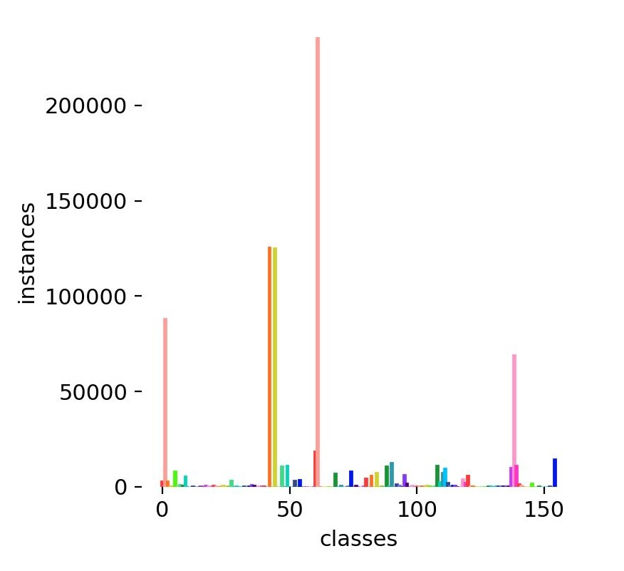
  </kbd>

<em>Figure 1: Histogram of Symbol Class Frequency</em>

The confusion matrix below represents the performance of the YOLOv8x model after 500 epochs, highlighting the prediction accuracy across various symbol classes. Each cell shows the proportion of predictions made for a predicted class versus the true class, with a perfect prediction represented by a 1.0 in the diagonal cells. Please refer to the provided class index [file](deep_scores.yaml) to determine which symbol each class index corresponds to.

  <kbd style="border: 1px solid #ccc; box-shadow: 4px 4px 5px #888;">
    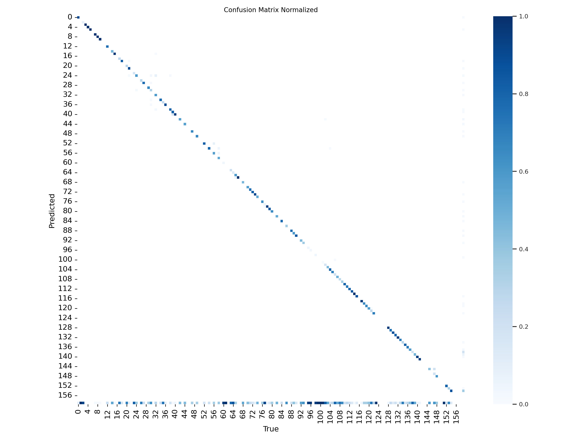
  </kbd>

<em>Figure 2: Normalized Confusion Matrix for Symbol Detection Using YOLOv8x</em>

After training the YOLOv8n model for 500 epochs for approximately 9 hours, here are the losses:

  <kbd style="border: 1px solid #ccc; box-shadow: 4px 4px 5px #888;">
    
  </kbd>

<em>Figure 3: Symbol Classification Using YOLOv8n After 500 Epochs</em>

  
Both training and validation box loss, as well as classification loss, decrease sharply initially and then level off, showing that the model is learning to predict the bounding boxes and classify the music symbols. The distribution-focused loss follows a similar trend, improving the model's distribution predictions. Additionally, precision and recall metrics consistently increased, demonstrating that the model's accuracy and completeness in symbol detection are improving. Although the rate of decrease in the losses diminished towards the end of the 500 epochs, we wanted to see whether the decrease would continue or if it would stabilize around similar levels. Therefore, we decided to train for an additional 500 epochs and observed the following Precision-Confidence Curve and Precision-Recall Curve.

  <kbd style="border: 1px solid #ccc; box-shadow: 4px 4px 5px #888; margin-right: 10px;">
    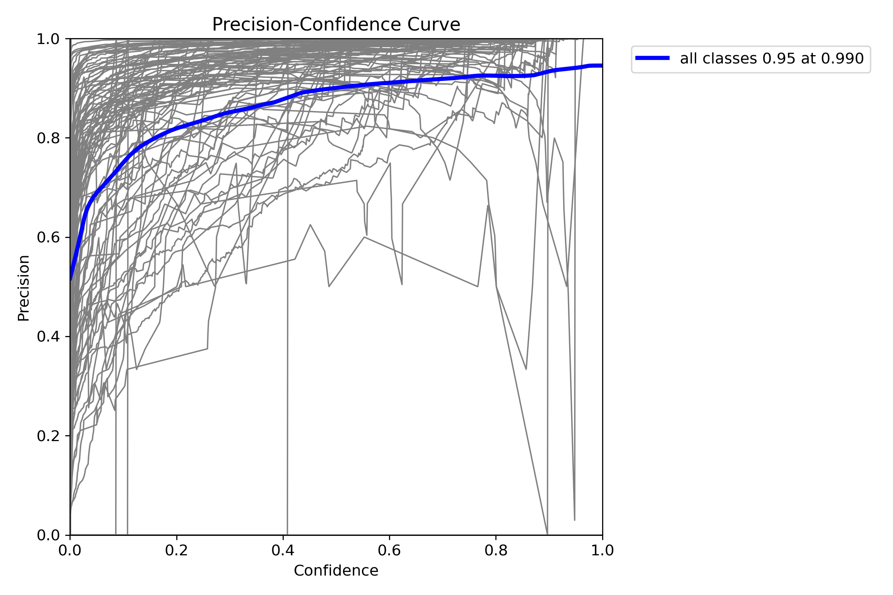
  </kbd>
  
  <kbd style="border: 1px solid #ccc; box-shadow: 4px 4px 5px #888;">
    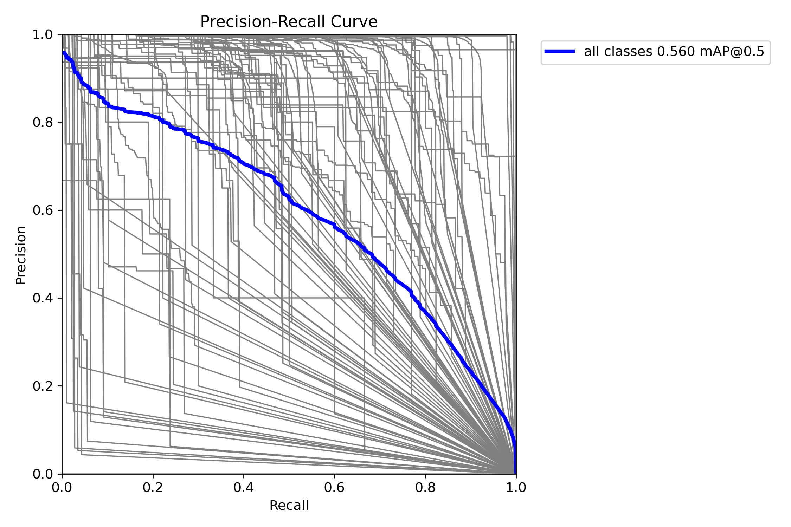 
  </kbd>

  <em>Figure 4 and 5: Precision and Precision-Recall Curves of YOLOv8n Model for Symbols Detection After 1000 Epochs</em>

The Precision-Confidence Curve now achieves a precision of 0.95 at a confidence level of 0.990 for all classes, while the Precision-Recall Curve has a mean Average Precision (mAP) at an Intersection Over Union (IOU) of 0.5 of 0.560 across all classes. These values indicate an improvement from the previous results observed at the end of the initial 500 epochs, demonstrating that the model remains open to training even though the decrease in loss is quite slow compared to the first epochs. Please see the [documentation](/images/yolo_for_symbols_v8n/) to see the other plots using YOLOv8n. After realizing that it becomes harder to improve the models with each epoch, we decided to use the YOLOv8m model, which has approximately 25.9 million parameters—about 8 times more than the YOLOv8n model with 3.2 million parameters. Using the same settings, we trained it for 500 epochs and observed the following results:

  <kbd style="border: 1px solid #ccc; box-shadow: 4px 4px 5px #888; margin-right: 10px;">
    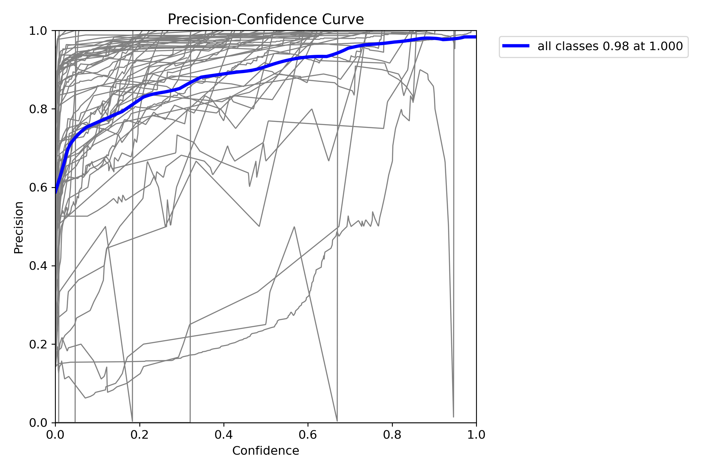
  </kbd>
  
  <kbd style="border: 1px solid #ccc; box-shadow: 4px 4px 5px #888;">
    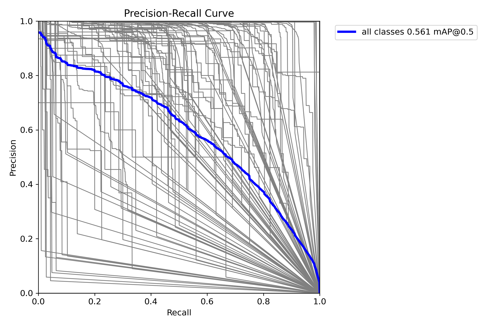 
  </kbd>

  <em>Figure 6 and 7: Precision and Precision-Recall Curves of YOLOv8m Model for Symbols Detection After 500 Epochs</em>

This took approximately 9 hours, similar to the YOLOv8n model, which was expected to have a longer duration based on the documentation from the Ultralytics page. We realized afterward that the YOLOv8n model did not fully utilize the GPU. Please see this [plot](/images/yolo_for_symbols_v8m/losses.png) for their losses. Training for only 500 epochs and observing better results than from 1000 epochs of training with the YOLOv8n model hinted that as the number of parameters increases, training becomes more efficient in this case. Consequently, we decided to try the YOLOv8x model, and here are the results we observed:

  <kbd style="border: 1px solid #ccc; box-shadow: 4px 4px 5px #888; margin-right: 10px;">
    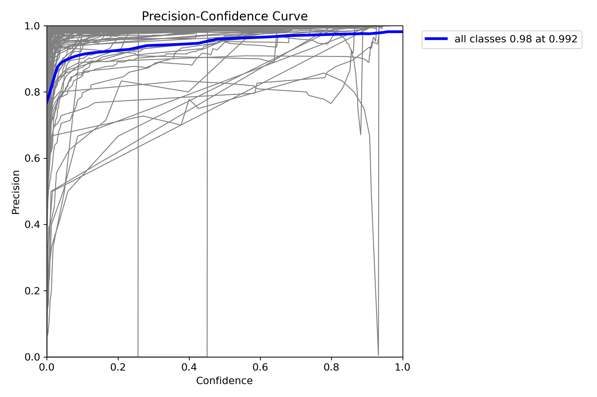
  </kbd>
  <kbd style="border: 1px solid #ccc; box-shadow: 4px 4px 5px #888;">
    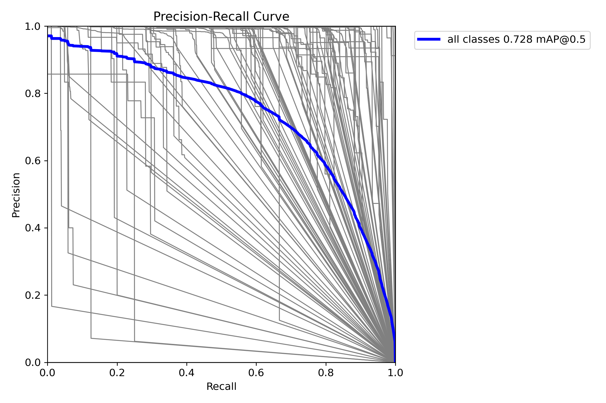 
  </kbd>

  <em>Figure 8 and 9: Precision and Precision-Recall Curves of YOLOv8x Model for Symbols Detection After 500 Epochs</em>

The above plots show that training with YOLOv8x model seems to yield the most efficient losses per each epoch, achieving 0.998 precision at 0.992 confidence level and while the Precision-Recall Curve has a mean Average Precision (mAP) at an Intersection Over Union (IOU) of 0.5 We achieved the highest mean Average Precision (mAP) at an Intersection Over Union (IOU) of 0.5, which is 0.728, across all classes after training YOLOv8x for 500 epochs. It is important to note the trade-off between training efficiency and training time. Although YOLOv8x resulted in the best models after 500 epochs, its training time is considerably longer than that of the YOLOv8n and YOLOv8m models. Training YOLOv8x took around 32 hours, approximately 3-4 times more than YOLOv8m.

And here is a sample prediction from test set using the YOLOv8x:

  <kbd style="border: 1px solid #ccc; box-shadow: 4px 4px 5px #888;">
    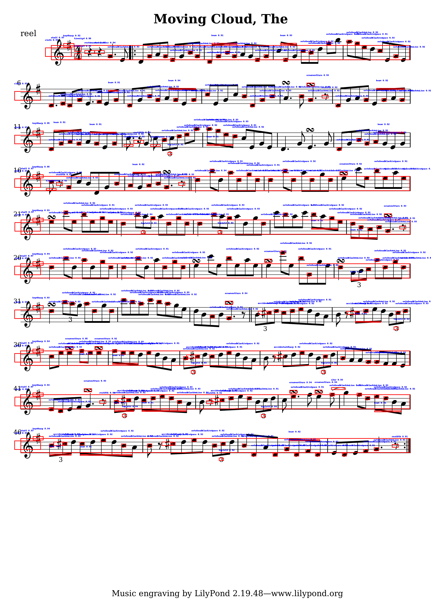
  </kbd>

<em>Figure 10: Predicted Sample From Test Set 'lg-110143839-aug-gonville-.png' Using the YOLOv8x </em>

The most successful classes, based on mAP50 using the YOLOv8x:

  
| Class                    | Instances | Precision | Recall | mAP50 |
| ------------------------ | --------- | --------- | ------ | ----- |
| restHBar                 | 27        | 1.000     | 0.998  | 0.995 |
| segno                    | 55        | 0.984     | 1.000  | 0.995 |
| coda                     | 49        | 0.950     | 1.000  | 0.995 |
| clefG                    | 2203      | 0.999     | 0.999  | 0.995 |
| clefF                    | 1488      | 0.998     | 0.994  | 0.995 |
| tremolo4                 | 13        | 0.872     | 1.000  | 0.995 |
| timeSig0                 | 83        | 0.897     | 1.000  | 0.994 |
| clefCAlto                | 255       | 0.996     | 0.988  | 0.993 |
| clefCTenor               | 167       | 0.989     | 0.988  | 0.993 |
| rest64th                 | 93        | 0.963     | 0.989  | 0.991 |

<em>Figure 11: Top 10 Most Accurate Classes by mAP50 </em>

On the other end of the spectrum, the worst-performing classes highlight significant model struggles. The "stem" class, which accounts for approximately 26.6% of the total instances, has precision and recall values of 0.0, leading to an mAP50 of 0.0. Similarly, "tuplet9," "ledgerLine," and "articTenutoBelow" also have mAP50 values of 0.0. These poor performances drag down the model's overall effectiveness and suggest the need for adjustments in image size, resolution, training hyperparameters, or additional training data.

  
| Class                   | Instances | Precision | Recall | mAP50 |
| ----------------------- | --------- | --------- | ------ | ----- |
| tuplet9                 | 1         | 0.000     | 0.000  | 0.000 |
| ledgerLine              | 23809     | 1.000     | 0.000  | 0.000 |
| stem                    | 65062     | 0.000     | 0.000  | 0.000 |
| articTenutoBelow        | 27        | 0.000     | 0.000  | 0.000 |
| articStaccatissimoAbove | 59        | 0.000     | 0.000  | 0.000 |
| articStaccatissimoBelow | 89        | 0.540     | 0.011  | 0.097 |
| tremolo2                | 16        | 0.622     | 0.125  | 0.156 |
| articTenutoAbove        | 82        | 0.637     | 0.061  | 0.172 |
| flag32ndDown            | 239       | 0.939     | 0.059  | 0.209 |
| articStaccatoBelow      | 503       | 0.926     | 0.038  | 0.261 |

<em>Figure 12: Classes with the Lowest Detection Performance </em>

### Measure Detection Using YOLO
Lastly, we trained a YOLOv8m model for 500 epochs to detect only the measures, and here are the results:

  <kbd style="border: 1px solid #ccc; box-shadow: 4px 4px 5px #888;">
    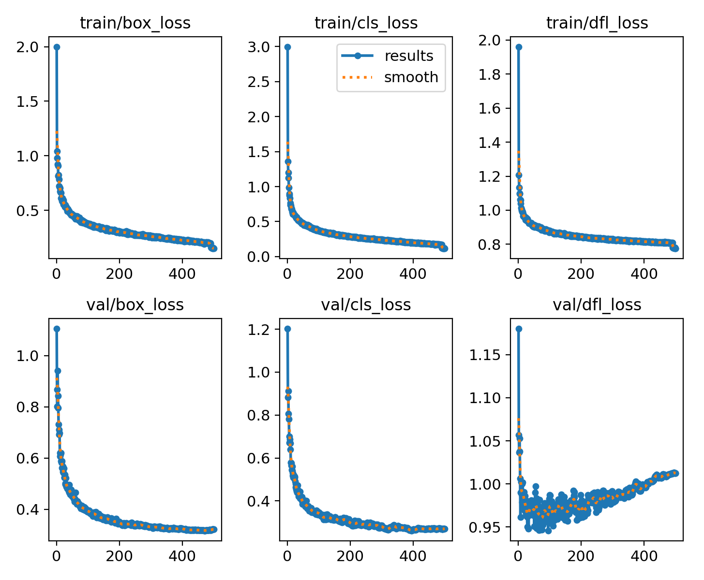
  </kbd>

<em>Figure 13: Loss Plots for Measure Detection Using YOLOv8m </em>

And here is a sample prediction from the test set using this model:

  <kbd style="border: 1px solid #ccc; box-shadow: 4px 4px 5px #888;">
    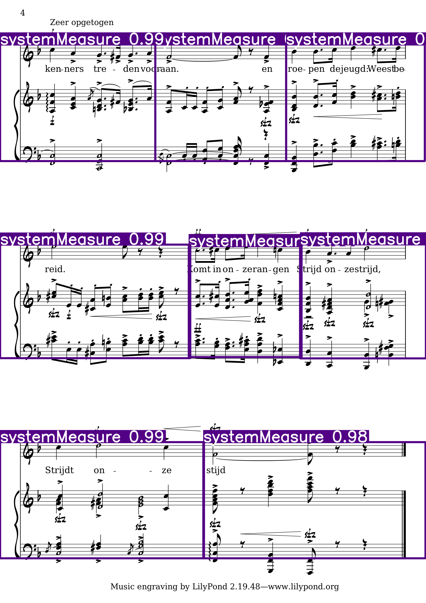
  </kbd>

<em>Figure 14: Predicted Sample From Test Set 'lg-140707771-aug-lilyjazz--page-4.png' Using YOLOv8m</em>

## Faster R-CNN Models Results

  <kbd style="border: 1px solid #ccc; box-shadow: 4px 4px 5px #888;">
    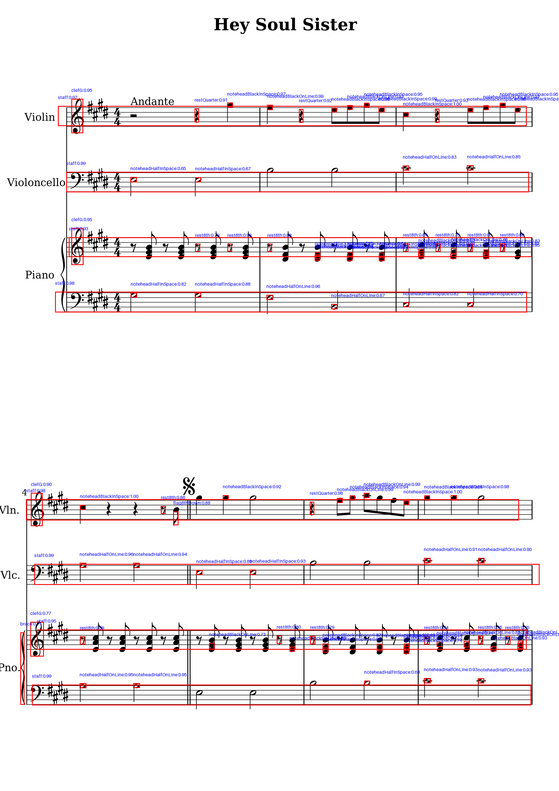
  </kbd>

<em>Figure 15: Symbol Classification Using Faster R-CNN</em>

## Future Work

- Training Set Refinement: Consider a larger dataset, implement oriented bounding boxes, and ensure each class is present in both the train and test sets.
- Train more epochs using YOLOv8x and YOLOv8m.
- Create an ensemble of YOLO models to classify symbols by relative symbol size.
- Enhance measure segmentation to capture notes positioned above or below the staff lines.
- End-to-End OMR System: The next major goal is to translate the classified symbols into machine readable Kern or XML music format using LSTM or Transformer architectures.

## Contributors
[Maricela Abarca](https://github.com/myabarca)  
[Eren Bardak](https://github.com/eren-bardak)  
[Brandon Hom](https://github.com/bwhom2000)  
[Eric Shen](https://github.com/sheneric211)  
[Prof. Mustafa Hajij](https://www.mustafahajij.com/)

## Acknowledgements
We extend our gratitude to the creators of the DeepScoresV2 dataset for their comprehensive collection of musical symbols and annotations.
